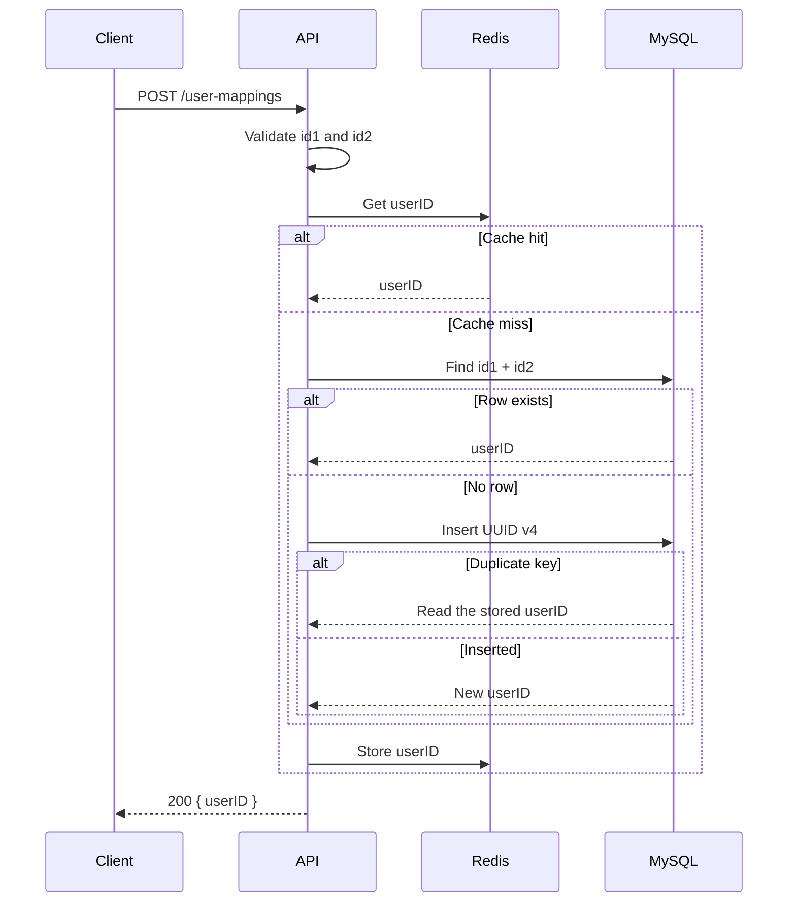

# User Mapping API

NestJS service that returns a stable `userID` for an `id1` and `id2` pair. The same pair always resolves to the same UUID. MySQL 8 stores the mapping. Redis caches lookups and is not the source of truth.

## Prerequisites

- Node.js 22
- Docker Desktop

The NestJS app runs on the host. Docker runs MySQL 8 and Redis. A local MySQL 5.7 can keep port `3306`; the MySQL 8 container is published on `3307`.

## Installation

```powershell
cd user-mapping-api
npm install
copy .env.example .env
```

`.env` holds the database password and is listed in `.gitignore`. Change `DB_PASSWORD` before the first `docker compose up` if you do not want the sample value `change-me`.

| Variable | Purpose |
|---|---|
| `PORT` | HTTP port, default `3000` |
| `DB_HOST` | MySQL host. Use `localhost` when the app runs on the host |
| `DB_PORT` | Host port of MySQL 8. `3307` matches `docker-compose.yml` |
| `DB_USERNAME` | MySQL user created by the container |
| `DB_PASSWORD` | Password for that user and for the MySQL root account |
| `DB_DATABASE` | Database name. The container creates it |
| `REDIS_HOST` | Redis host |
| `REDIS_PORT` | Redis port |
| `REDIS_PASSWORD` | Leave empty for the local Redis container |
| `REDIS_TTL_SECONDS` | Cache lifetime in seconds, default `86400` |

## Database

Start MySQL 8 and Redis:

```powershell
docker compose up -d
```

On first startup the container creates the `user_mapping` database and runs `migrations/001-create-user-mappings.sql`. The table `user_mappings` stores `id1`, `id2`, and `user_id`. The unique key `uk_id1_id2` identifies one row for each pair. `id1` and `id2` are compared case-sensitively (`utf8mb4_bin`) and are limited to 128 characters.

`docker compose down` stops the containers and keeps the data. `docker compose down -v` deletes the data volume; the next `up` creates the database and table again.

## Run the application

```powershell
npm run start:dev
```

The API listens on `http://localhost:3000`. Swagger UI is at `http://localhost:3000/docs`.

## API

`POST /user-mappings`

Both `id1` and `id2` are required non-empty strings. A missing field, an empty string, or an unknown field returns `400`.

```json
{
  "id1": "ABC123",
  "id2": "XYZ456"
}
```

```json
{
  "userID": "550e8400-e29b-41d4-a716-446655440000"
}
```

The response is `200` whether the pair is new or already stored. A later request with the same pair returns the same `userID`.

```powershell
curl.exe -X POST http://localhost:3000/user-mappings -H "Content-Type: application/json" -d "{\"id1\":\"ABC123\",\"id2\":\"XYZ456\"}"
```

## Tests

Unit tests mock MySQL and Redis. They cover a new pair, an existing pair, a duplicate-key conflict, a Redis miss, and invalid request bodies.

```powershell
npm test
```

## Technical decisions

Redis caches `id1 + id2` to `userID` so a repeated request can skip MySQL. Keys use the form `user-mapping:{id1}:{id2}`. If Redis is down, reads return no cached value and writes are skipped; the request still uses MySQL. A stored mapping is not updated, so a cache entry does not need to be invalidated before its TTL.

Two requests for a new pair can both see that no row exists and both try to insert. The unique key allows one insert. The other receives MySQL error `1062`, reads the committed row, and returns that `userID`.


